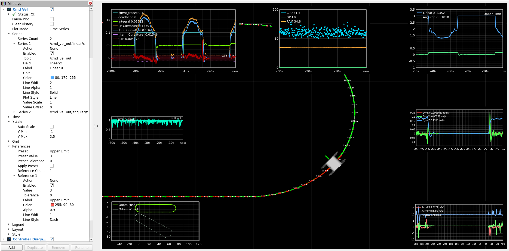

# rviz_2d_plot_plugin 📈


RViz 2 display plugin for rendering live 2D plots directly inside the 3D viewport. It is built for robotics debugging and runtime observability: subscribe to ROS 2 topics, select numeric or boolean fields at runtime, and visualize time-series or XY data without writing custom message extractors or plotting glue code.



---

## Features

- **Runtime field introspection**: plot numeric and boolean fields from ROS 2 messages without generated message-specific code.
- **Time series and XY plots**: plot values over time or field-vs-field, such as odometry X/Y.
- **Multiple series**: combine series from different topics with independent colors, styles, and scaling.
- **Reference lines**: add horizontal markers with optional tolerance bands and presets.
- **Axis control**: auto-scale with padding, use fixed limits, or preserve 1:1 aspect in XY mode.
- **Plot styling**: choose line, step, or point rendering with solid, dashed, dotted, or dash-dot strokes.
- **Timestamp modes**: use receive time or `std_msgs/Header` stamps.
- **Value transforms**: apply per-series scale and offset for unit conversion.
- **Plot controls**: pause updates or clear history without restarting RViz.
- **RViz persistence**: save and restore configuration through `.rviz` files.

## Install

```bash
cd ~/ros2_ws/src
git clone https://github.com/amgaber95/rviz_2d_plot_plugin.git
cd ~/ros2_ws
rosdep install --from-paths src --ignore-src -r -y
colcon build --packages-select rviz_2d_plot_plugin
source install/setup.bash
```

---

## Quick Start

1. In RViz 2 → **Add** → **Plot2D**
2. Set **Topic** and **Field** for each series
3. Adjust layout, axes, and style

---

## Configuration

<details>
<summary><b>Plot Mode</b></summary>

| Mode | Description |
|---|---|
| Time Series | X-axis is time. Samples plotted at receive or header timestamp. |
| XY | X-axis is a message field. Set `X Field` and `Y Field` per series. |

</details>

<details>
<summary><b>Series</b></summary>

| Property | Description |
|---|---|
| Topic | ROS 2 topic (dropdown lists active topics) |
| Field | Nested field path, e.g. `linear/x` (auto-discovered) |
| X Field / Y Field | Field paths for XY mode |
| Label | Legend display name |
| Unit | Appended to legend values |
| Color | RGB line color |
| Line Width | Stroke width (px) |
| Line Alpha | Opacity 0.0–1.0 |
| Line Style | Solid · Dash · Dot · DashDot |
| Plot Style | Line · Step · Points |
| Value Scale | Multiply raw values |
| Value Offset | Add after scaling |

</details>

<details>
<summary><b>References</b></summary>

| Property | Description |
|---|---|
| Preset | None · Zero Line · Upper Limit · Lower Limit |
| Value | Y position of the line |
| Tolerance | Shaded band ± this amount |
| Label | Legend text |
| Color / Alpha | Appearance |
| Line Style | Solid · Dash · Dot · DashDot |

</details>

<details>
<summary><b>Time</b></summary>

| Property | Description |
|---|---|
| Window Seconds | Rolling window width |
| Refresh Rate | Render frequency in Hz (default 20) |
| Time Source | Receive Time · Message Header Stamp |
| XY History Mode | Rolling Time Window · All Samples |

</details>

<details>
<summary><b>Axes</b></summary>

| Property | Description |
|---|---|
| Auto Scale | Fit to visible data with padding |
| X/Y Min / Max | Fixed limits when auto-scale is off |
| Axis Scale | Independent · 1:1 (XY mode) |

</details>

<details>
<summary><b>Grid</b></summary>

| Property | Description |
|---|---|
| Major / Minor Grid | Toggle visibility |
| X/Y Major Ticks | Target major tick count per axis |
| Minor Divisions | Subdivisions between major ticks |

</details>

<details>
<summary><b>Legend</b></summary>

| Property | Description |
|---|---|
| Enabled | Show / hide |
| Position | Top Left · Top Right · Bottom Left · Bottom Right |
| Show Values | Latest numeric value next to each label |
| X/Y Offset | Pixel inset from corner |

</details>

<details>
<summary><b>Layout</b></summary>

| Property | Description |
|---|---|
| Width / Height | Plot size in pixels |
| H Alignment | Left · Center · Right |
| V Alignment | Top · Center · Bottom |
| X/Y Offset | Pixels from anchor edge |

</details>

<details>
<summary><b>Style</b></summary>

| Property | Description |
|---|---|
| Background Color / Alpha | Plot background |
| Axis Color | Axis lines and tick labels |
| Grid Color | Grid lines |
| Text Color | Legend and values |
| Font Size | Points |

</details>

## License

This project is licensed under the MIT License. See the [LICENSE](LICENSE) file for details.

## Contributing

Contributions are welcome. Please feel free to submit issues or pull requests.

## Maintainer

**Abdelrahman Mahmoud**

Email: abdulrahman.mahmoud1995@gmail.com  
GitHub: [@amgaber95](https://github.com/amgaber95)
